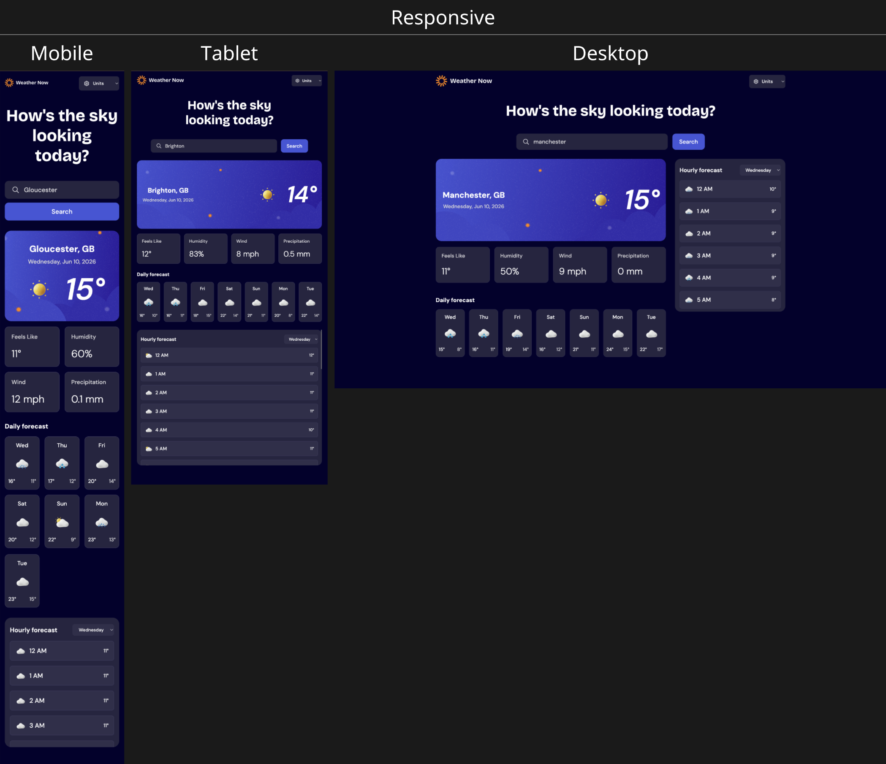

# Frontend Mentor - Weather API App

**Front-End Website Development | HTML5, CSS3, JavaScript**

## Table of contents

- [Overview](#-overview)
- [Live-Demo](#-live-demo)
- [Built-with](#️-built-with)
- [Features](#-features)
- [Project-Goals](#-project-goals)
- [The-Challenge](#-the-challenge)
- [Final-UI-Screenshots](#-final-ui-screenshots)
- [Development-Screenshots](#️-development-screenshots)
- [Key-Learnings](#-key-learnings)
- [CORS-Issue](#️-important---cors-issue-development-only)
- [AI-Collaboration](#-ai-collaboration)
- [Useful-Resources](#-useful-resources)

## 📚 Overview

Developed a fully responsive Weather App based on a Frontend Mentor challenge using provided design mockups for mobile, tablet, and desktop layouts. Built the application from scratch using HTML, CSS and JavaScript, integrating weather APIs to display real-time weather data, forecasts, and location-based information.

The application was designed with a mobile-first approach and optimised to provide a seamless user experience across a range of devices.

This implementation focuses on core functionality, responsive design, and API integration. Some optional features from the original challenge were not included.

The GitHub repository contains the complete source code and development history.

---

## 🌐 Live Demo

[Weather API App](https://weather-api-app-psi.vercel.app)

---

## 🛠️ Built with

- Semantic HTML5 markup
- CSS3 custom properties
- Flexbox
- CSS Grid
- Mobile-first workflow
- Vanilla JavaScript

---

## 📱 Features

- Fully responsive design (mobile, tablet, and desktop)
- Real-time weather data via API integration
- Location search functionality
- Dynamic weather conditions and forecasts
- Mobile-first development approach
- Clean and accessible user interface

---

## 🎯 Project Goals

- Practice responsive web design techniques
- Improve CSS layout and positioning skills
- Strengthen JavaScript DOM manipulation skills
- Work with real-world weather APIs
- Build a fully responsible UI from professional design references
- Improve Git and GitHub workflow through consistent commits

---

## 📱 The Challenge

- Responsive mobile, tablet and desktop layouts
- Search weather information by location
- Real-time weather data integration
- 7-day weather forecast display
- Hourly weather forecast section
- Temperature and weather condition indicators
- Metric and Imperial unit conversion
- Dynamic weather icons and UI states
- Interactive JavaScript functionality
- Hover and focus states for interactive elements
- Clean and modern responsive UI

---

## 📷 Final UI Screenshots

### Responsive Design (Mobile, Tablet, Desktop)

---

## 🛠️ Development Screenshots

Screenshots captured throughout the development and testing process.

- [View Development Screenshots](https://github.com/JigarBlue/Weather-API-App/tree/main/assets/test-screenshots)

---

## 📚 Key Learnings

- Strengthened skills in responsive web design using a mobile-first approach
- Improved CSS structuring and layout building from UI mockups
- Built practical experience with JavaScript functionality and DOM manipulation
- Integrated a weather API to display real-time data
- Improved ability to convert design mockups into a fully functional web application

---

## ⚠️ Important - CORS Issue (Development Only)

If weather data does not load, your browser may be blocking the request due to CORS policy.

Open Developer Console:

- Right click on the page → Inspect → Console

If you see a CORS error, this is a browser security restriction.

### 🧪 Temporary Fix (Chrome Only)

Install the Allow CORS extension:

- https://chromewebstore.google.com/detail/allow-cors-access-control/lhobafahddgcelffkeicbaginigeejlf?hl=en

Enable the extension and refresh the page.

> Note: This step applies only to Chrome. Other browsers may require different CORS testing tools or settings.

### 🚀 Recommended Fix (Best Practice)

For production or cross-browser support, enable CORS on the API server instead of relying on browser extensions.

---

## 🤖 AI Collaboration

This project was developed with assistance from AI tools, including ChatGPT and Claude.

These tools were used to:

- Explain JavaScript concepts and code functionality
- Clarify unfamiliar sections of code
- Assist with debugging and troubleshooting
- Provide guidance on best practices and implementation approaches

All project planning, development, testing, and final implementation decisions were completed and reviewed by the developer.

---

## 🔖 Useful Resources

- [MDN Web Docs - JavaScript](https://developer.mozilla.org/en-US/docs/Web/JavaScript)

- [Open-Meteo](https://open-meteo.com/en/docs)

- [Nominatim OpenStreet Map Data](https://nominatim.org/release-docs/develop/api/Search/)

- [Google Web Fonts Helper](https://gwfh.mranftl.com/fonts)

- [Accessibility Developer Guide](https://www.accessibility-developer-guide.com)

- [Format Date](https://www.freecodecamp.org/news/javascript-date-format-how-to-format-a-date-in-js/)
